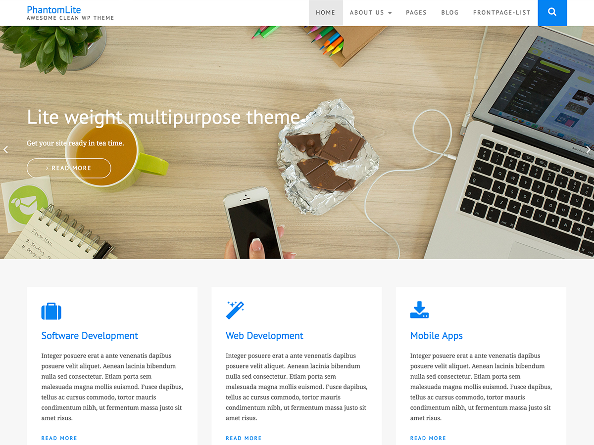

#### See: [Official Demo](https://phantomthemes.com/view?theme=PhantomLite) | Read: [Official Docs Page](https://phantomthemes.com/phantom-lite-doc/)

# Phantomlite Free Bootstrap Wordpress Theme 

Website: [https://phantomthemes.com](https://phantomthems.com)

## About

Phantom lite is minimalist WordPress theme, probably the lightest theme in WordPress, Designed considering site speed in mind.Phantom lite has many features like multiple sidebar, grid layout specially designed for the blog.

## Tags

 two-columns,three-columns,full-width-template,sticky-post,grid-layout,custom-logo,right-sidebar,translation-ready, custom-background, theme-options,featured-images, custom-menu, threaded-comments, blog, footer-widgets

## License

phantomlite WordPress Theme, Copyright 2018 PhantomThemes
phantomlite is distributed under the terms of the GNU GPL

This program is free software: you can redistribute it and/or modify
it under the terms of the GNU General Public License as published by
the Free Software Foundation, either version 2 of the License, or
(at your option) any later version.

This program is distributed in the hope that it will be useful,
but WITHOUT ANY WARRANTY; without even the implied warranty of
MERCHANTABILITY or FITNESS FOR A PARTICULAR PURPOSE. See the
GNU General Public License for more details.

## Changelog
See [changelog](CHANGELOG.md)

## Basic Features

Feature of Phantomlite:

1. List Layout
2. Grid Layout
3. Right Side Bar
4. Full Width Template
5. Footer Widgets
6. Light Weight
7. Speed

## Installation
There are several ways to install phantom. We'll look at three of them: (1) classic install by uploading phantomthemes to a WordPress install,and (2) using the theme directory in WordPress. 

### Classic install
- Download the phantomlite folder from GitHub or from [https://phantomthemes.com/items/phantomlite-wordpress-theme/](https://phantomthemes.com/items/phantomlite-wordpress-theme/)
- Upload it into your WordPress installation theme subfolder: `/wp-content/themes/`
- Login to your WordPress backend
- Go to Appearance → Themes
- Activate the phantomlite theme

### WordPress.org install
- Open your WordPress backend
- Click on "Appearance -> Themes"
- Hit the "Add new" button
- Search for "phantomlite"
- Hit the "install" button
- Activate the theme

## Licenses & Credits

- Based on Underscores http://underscores.me/, (C) 2012-2016 Automattic, Inc., [GPLv2 or later](https://www.gnu.org/licenses/gpl-2.0.html)
- normalize.css http://necolas.github.io/normalize.css/, (C) 2012-2016 Nicolas Gallagher and Jonathan Neal, [MIT](http://opensource.org/licenses/MIT)

* Images Used in Screenshot
	https://unsplash.com/photos/_aNFQ_7RxNc , [CC0],(https://unsplash.com/license)

- .css Based on https://github.com/dhg/Skeleton#license All parts of Skeleton are free to use and abuse under the open-source MIT license and Underscores http://underscores.me/, (C) 2012-2016 Automattic, Inc., [GPLv2 or later](https://www.gnu.org/licenses/gpl-2.0.html)

# Bootstrap
All files from the /bootstrap folder are from the Bootstrap v3.3.6 package.
Resource URI: http://getbootstrap.com/
Copyright: 2011-2015 Twitter, Inc
Licensed under MIT (https://github.com/twbs/bootstrap/blob/master/LICENSE)

# Fonts
    Font Awesome - http://fontawesome.io/
    Font License: SIL OFL 1.1
    Code License: MIT License  
    License: http://fontawesome.io/license 

# Owlcarousel
http://owlgraphic.com/owlcarousel/, Author Bartosz Wojciechowski, License The MIT License (MIT)
